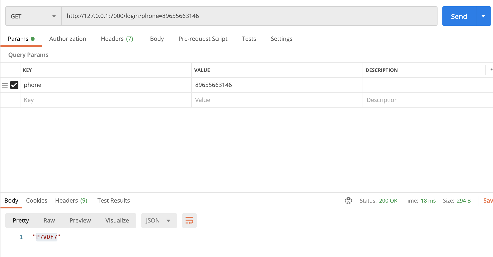
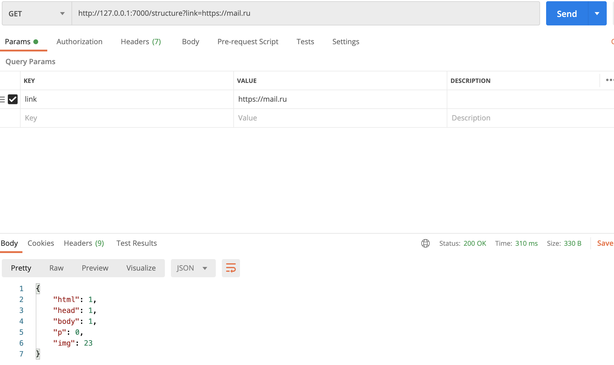
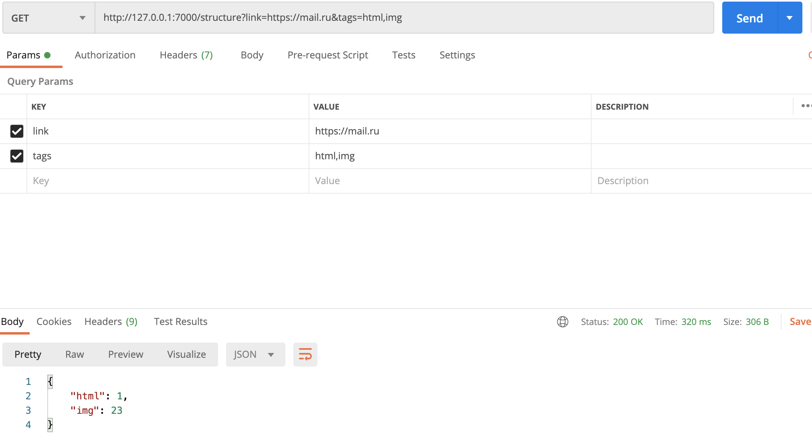
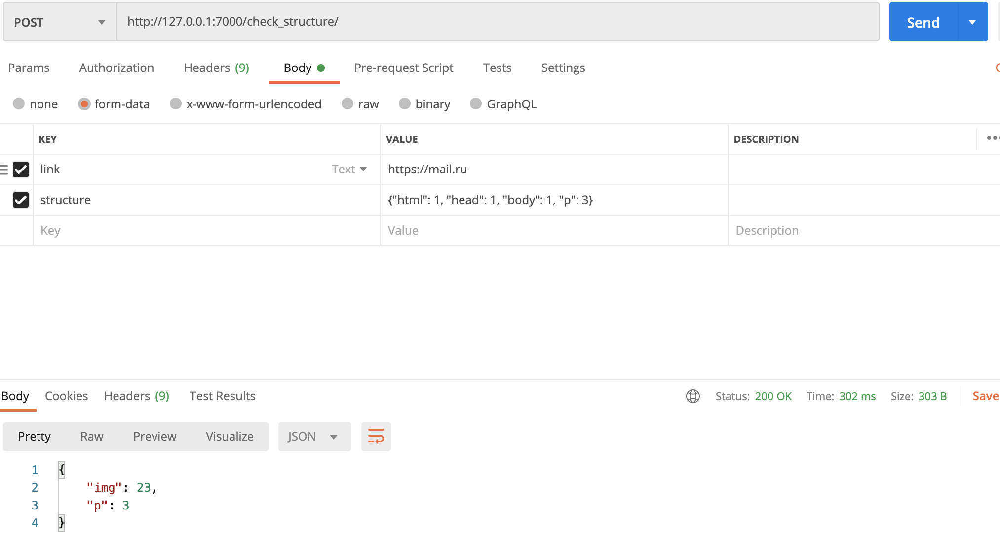

### Блок авторизации

1. /login?phone=<телефон> GET запрос с номером телефона, в ответ должен прийти 6-значный код
*** При указании телефона верного формата генерирует случайный код из 6 символов

2.  /login POST запрос вида *`{"phone": "[+71111111111](tel:+71111111111)", "code": "QWDCR4"}`* - в ответ должен прийти `{"status": "OK"}` если код верный и `{"status": "Fail"}` если код не верный. 
Можно хранить коды для авторизации в коде, не используя базу данных или кэш хранилища для этого

*** После указания телефона и кода в параметрах, идет проверка на наличие данных параметров в словаре

### Блок работы с ссылками

1.  /structure GET запрос, В ответ должен прийти словарь с количеством каждого типа HTML-тэгов (например *`{"html": 1, "head": 1, "body": 1, "p": 10, "img": 2}`*) для сайта [freestylo.ru](http://freestylo.ru/)
*** Возвращает кол-во html тэгов (искомые тэги ['html', 'head', 'body', 'p', 'img']) по дефолту строит url=https://freestylo.ru/

2. /structure?link=<ссылка> То же, что и выше, но теперь сайт задается в запросе
*** Возвращает тэги с указанием url в параметрах

3. /structure?link=<ссылка>&tags=html,img То же что и выше, но теперь помимо ссылки задается массив тэгов через запятую, которые нужно вернуть в ответе
*** Возвращает кол-во тэгов, хаданных в параметрах

4. /check_structure POST запрос вида  `{"link": "freestylo.ru", "structure": {"html": 1, "head": 1, "body": 1, "p": 10, "img": 2}}` 
Который для данный ссылки проверяет структуру html тэгов. В ответ должно приходить `{"is_correct": True}` если все верно и `{"is_correct": False, "difference": {"p": 2, "img": 1}}`  если есть ошибки, где difference - это разница структур. 
Например, если верная структура - `{"html": 1, "head": 1, "body": 1, "p": 4}` а передавалась структура `{"html": 1, "head": 1, "body": 1, "p": 2, "img": 1}` то разница будет `{"p": 2, "img": 1}`
*** Возвращает разницу кол-ва тэгов + кол-во тэгов, которых нет

